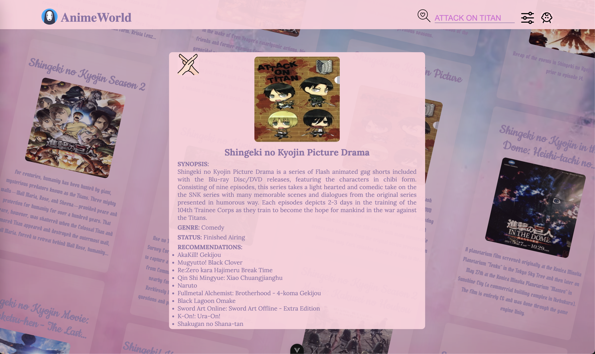
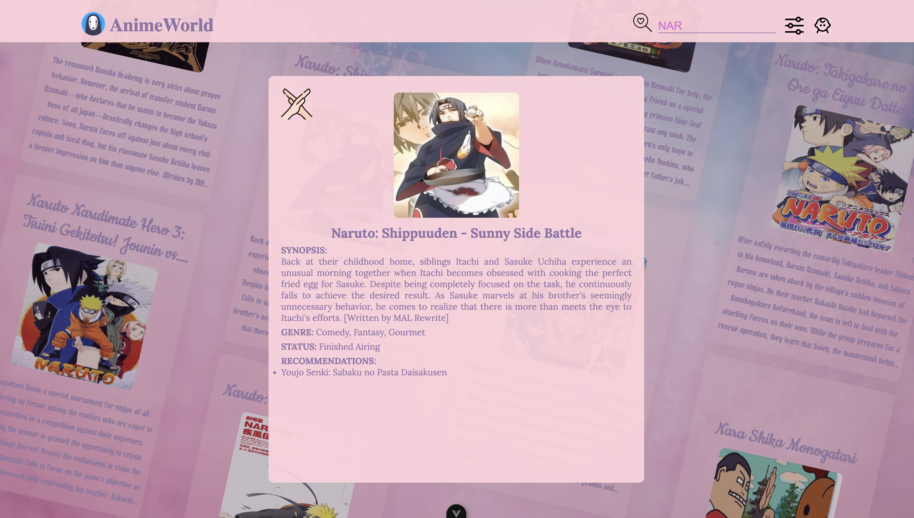

# AnimeWorld

Ссылка, чтобы ознакомиться с проектом: https://strong-pixie-8dc283.netlify.app

Визуальный браузер аниме с уникальным интерфейсом и плавной навигацией. Ниже несколько примеров работы:

## Пример 1:

<p align="center">
  
  
  
</p>

## Пример 2:

<p align="center">
  
  
</p>

## Особенности

- Уникальный вертикальный слайдер — 4 синхронизированных слайдера для эффектного просмотра
- Моментальный поиск по базе аниме (Jikan API)
- Интерактивные карточки — клик для просмотра детальной информации

## Как запустить?

```bash
# Установите зависимости
npm install

# Запуск в development режиме
npm run dev

# Сборка для production
npm run build
```

## Технологии

- Vue 3
- Vite для сборки
- Swiper.js — плавные вертикальные слайдеры (рекомендую запускать в chrome)
- Axios — HTTP-клиент для работы с API
- Jikan API — бесплатное API для данных об аниме

## Использование

### Основной интерфейс
1. Главный экран — показывает 4 вертикальных слайдера с популярными аниме
2. Прокрутка — используйте колесо мыши или тач для навигации
3. Выбор аниме — кликните на любую карточку для открытия детальной информации

### Поиск
- Введите название аниме в поле поиска (минимум 2 символа)
- Результаты обновляются в реальном времени
- Поиск использует Jikan API (MyAnimeList)

### Детальная информация
В модальном окне отображается:
- Постер аниме
- Описание (synopsis)
- Жанры
- Возрастной рейтинг
- Статус выпуска
- Год выхода
- Рекомендации (до 10 похожих аниме)

## 🔧 API

Проект использует [Jikan API](https://jikan.moe/) — бесплатное API MyAnimeList.

**Основные эндпоинты:**
- `GET https://api.jikan.moe/v4/anime?order_by=score` — популярные аниме
- `GET https://api.jikan.moe/v4/anime?q={query}` — поиск по названию
- `GET https://api.jikan.moe/v4/anime/{id}/recommendations` — рекомендации
